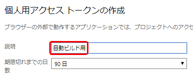

name: inverse
layout: false
class: center, middle, inverse

<!-- github Web ページ https://qiita.com/budougumi0617/items/221bb946d1c90d6769e9 -->
# REST API for TFS

---
## TFS とは？

* TFS = Team Foundation Server  
ご存知の通り、ソースコードのバージョン管理システム

---
## REST API とは？

>Webシステムを外部から利用するためのプログラムの呼び出し規約(API)  
>RESTと呼ばれる設計原則に従って策定されたもの  

引用：[IT用語辞典 e-Words](http://e-words.jp/w/RESTful_API.html) 

* REST = REpresentational State Transfer  
* API = Application Programming Interface

HTTP の GET や POST で操作し、データのやり取りを JSON などで行うという程度のイメージでOK

---
## 目標

C# で REST API を用いて TFS を操作するまでの流れを知る  
(今回は例として自動ビルドを実行してみる)

---
## 全体の流れ

準備
1. Visual Studio プロジェクトを用意 
1. アクセストークンの追加 
1. ビルド定義を作成

実装
1. HttpClient を作成
1. ビルド定義の名称から、ビルド定義を検索
1. 取得したビルド定義を実行

---
## 準備①
## Visual Studio プロジェクトを用意  

_demo_

---
### コンソールのプロジェクトを作成


---
## nuget で Json パッケージを取得
  
```
PM> Install-Package Newtonsoft.Json
```

---
## 参照が追加されていることを確認  
  

---

## 準備②
## アクセストークンの追加  
参考：[Authenticating with personal access tokens](https://docs.microsoft.com/en-us/azure/devops/integrate/get-started/authentication/pats?view=tfs-2018)  
_demo_

---
### TFS のアクセストークンページを開く

例  
http://_ServerName:8080_/tfs/_details/security/tokens

---
### [追加] をクリックする  


---
### [説明] を適当に入力する  


---
### [選択されたスコープ] を選択する  


---
### [ビルド (読み取りおよび実行)] にチェックを入れる  


---
### [トークンの作成] ボタンをクリックする
  

作成されたトークンは忘れずにコピーすること
 

---
## 準備③
## ビルド定義を作成

例  
http://_ServerName:8080_/tfs/_CollectionName_/_ProjectName_/_build

---
### 省略
今回は "MyBuild" というビルド定義が既に作ってあるものとする  
  
継続的インテグレーションだったり、デイリービルドでの単体テスト実行だったりの設定が書かれている  

---
## 準備終わり

---
### 実装①
### HttpClient を作成
``` cs
private static readonly HttpClient HttpClient;

HttpClient = new HttpClient();

HttpClient.DefaultRequestHeaders.Accept.Add(new MediaTypeWithQualityHeaderValue("application/json"));

string authParameter = Convert.ToBase64String(Encoding.ASCII.GetBytes($":{PersonalAccessToken}"));
HttpClient.DefaultRequestHeaders.Authorization = new AuthenticationHeaderValue("Basic", authParameter);
```
PersonalAccessToken は準備②で用意したアクセストークンを指定する  
インスタンスは static で保持する  
参考：[不適切なインスタンス化のアンチパターン](https://docs.microsoft.com/ja-jp/azure/architecture/antipatterns/improper-instantiation/)

---
### 実装②
### ビルド定義を検索
リファレンスを見るとこう書かれている

>Get a list of build definitions  
>GET https://{instance}/DefaultCollection/{project}/_apis/build/definitions?api-version={version}\[&name={string}\] 以下略

引用：[Get a list of build definitions](https://docs.microsoft.com/en-us/azure/devops/integrate/previous-apis/build/definitions?view=tfs-2018#get-a-list-of-build-definitions) 

---
<font color="Red">https://{instance}/DefaultCollection/{project}</font>/_apis/build/definitions?api-version={version}\[&name={string}\]  
この<font color="Red">赤字</font>部分は環境によって読み替える  

例  
http://_ServerName:8080_/tfs/_CollectionName_/_ProjectName_

---
<font color="Black">h</font>ttps://{instance}/DefaultCollection/{project}/_apis/build/definitions?"<font color="Red">api-version={version}</font>\[&definitions={string}\]  
この<font color="Red">赤字</font>部分はAPIバージョンで、TFSのバージョンと対応している

>|TFS Version|REST API Version|
>|:---|:---|
>|TFS 2017 Update 2|3.2|
>|TFS 2017 Update 1|3.1|
>|TFS 2017 RTW|3.0|
>|TFS 2015 Update 3|2.3|
>以下略

引用：[API and TFS version mapping](https://docs.microsoft.com/en-us/azure/devops/integrate/previous-apis/overview?view=tfs-2018#api-and-tfs-version-mapping) 

---
https://{instance}/DefaultCollection/{project}/_apis/build/definitions?api-version={version}<font color="Red">\[&definitions={string}\]</font>  
この<font color="Red">赤字</font>部分は検索したいビルド定義の名称を入れる

---
GET リクエストをして結果を見てみる  
``` cs
var response = await HttpClient.GetAsync($"http://ServerName:8080/tfs/CollectionName/ProjectName/_apis/build/definitions?name=MyBuild&api-version=3.2");
string responseBody = await response.Content.ReadAsStringAsync();
```

---
`string responseBody` の中身は JSON 形式データ
``` json
{
  "count": 1,
  "value": 
  [
    {
      略
      "id": 106,
      "name": "MyBuild",
      略
      }
    }
  ]
}
```

---
JSON 形式データ通りのプロパティを持ったクラスを定義して…
``` cs
public class GetResult
{
  public int count { get; set; }
  public List<Build> value { get; set; }
}

public class Build
{
  public int id { get; set; }
  public string name { get; set; }
}
```  

デシリアライズして、クラスをインスタンス化
``` cs
var getResult = JsonConvert.DeserializeObject<GetResult>(responseBody);
```

これでビルド定義の検索ができた

---
### 実装③
### 取得したビルド定義を実行
リファレンスを見るとこう書かれている

>Queue a build  
>POST https://{instance}/DefaultCollection/{project}/_apis/build/builds?api-version={version}

引用：[Queue a build](https://docs.microsoft.com/en-us/azure/devops/integrate/previous-apis/build/builds?view=tfs-2018#queue-a-buildあ) 

---
<font color="Red">https://{instance}/DefaultCollection/{project}</font>/_apis/build/builds?api-version={version}  
<font color="Red">このへん</font>と  

https://{instance}/DefaultCollection/{project}/_apis/build/builds?<font color="Red">api-version={version}</font>  
<font color="Red">このへん</font>は、ビルド定義を検索したときと同じ

---
今度は逆に、JSON 形式データを送る必要がある
``` json
{
  "definition": 
  {
    "id": 25
  },
  略
}
```

---
JSON 形式データ通りのプロパティを持った匿名型クラスを定義して…
``` cs
var requestBody = new
{
  definition = new
  {
    id = build.id
  },
};
```  

シリアライズして、送るデータを作成
``` cs
var content = new StringContent(JsonConvert.SerializeObject(requestBody), Encoding.UTF8, "application/json");
```

---
POST リクエストするとビルドが始まる 
``` cs
var response = await HttpClient.PostAsync($"http://ServerName:8080/tfs/CollectionName/ProjectName/_apis/build/builds?api-version=3.2", content)
```
